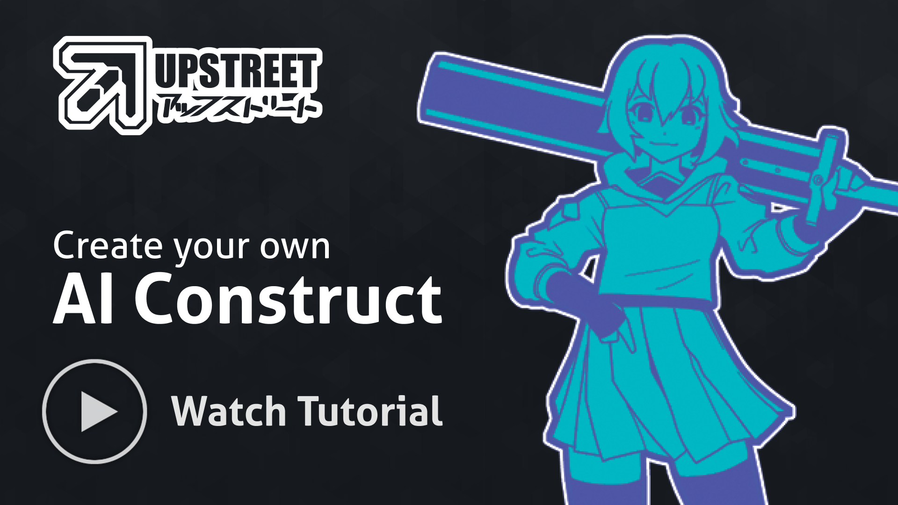

<!-- markdownlint-configure-file {
  "MD013": {
    "code_blocks": false,
    "tables": false
  },
  "MD033": false,
  "MD041": false
} -->

<div align="center" style="text-align: center">

[](https://upstreet.ai)


<!-- [](https://discord.gg/TfKW36rMj7) -->
[](https://npmjs.org/package/usdk)
[](https://upstreet.ai/usdk-discord)
[](https://x.com/upstreetai)

[Upstreet.ai](https://upstreet.ai) is an open source framework to build + deploy AI agents with React.

> Star (⭐️) [this repo](https://github.com/upstreetAI/upstreet-core) to support our development.

[Table of Contents](#in-this-repo) •
[Getting started with USDK](#getting-started-with-usdk) •
[Contributing](#contributing) •
[Attributions](#usdk-is-built-with)

</div>

[](https://www.youtube.com/watch?v=Fr78GhpaYB4&t=2s)

## In this repo...
### Chat App:
- 🌐 Link: https://upstreet.ai
- 📁 Directory: [/apps/chat](https://github.com/UpstreetAI/upstreet-core/tree/main/apps/chat)
- 📖 Documentation: [/apps/chat/README.md](https://github.com/UpstreetAI/upstreet-core/blob/main/apps/chat/README.md)

### Docs:
- 🌐 Link: https://docs.upstreet.ai
- 📁 Directory: [/apps/docs](https://github.com/UpstreetAI/upstreet-core/tree/main/apps/docs)
- 📖 Documentation: [/apps/docs/README.md](https://github.com/UpstreetAI/upstreet-core/blob/main/apps/chat/README.md)

### USDK:
- 📁 Directory: [/packages/usdk](https://github.com/UpstreetAI/upstreet-core/tree/main/packages/usdk)
- 📖 Documentation: [/apps/docs/README.md](https://github.com/UpstreetAI/upstreet-core/blob/main/packages/usdk/README.md)

## Getting started with USDK

If you want to get started with Upstreet Agents in general, you can simply install `usdk` via `pnpm`:

```bash
pnpm i -g usdk
```

> ⚠️ Please ensure you have Node version 22.9.0 or above, otherwise `usdk` will not work.

Read more about how to use `usdk` in the [documentation](https://docs.upstreet.ai/install).

If you want to dive deeper into `usdk` and Upstreet, you can [set up this repository locally.](#Setting-up-your-development-environment)

## Contributing

Found a bug? Want a new feature? [Open an issue](https://github.com/upstreetAI/upstreet-core/issues/new) on GitHub, or talk to the [community](https://upstreet.ai/usdk-discord) to get help.

### Setting up your development environment

#### Install dependencies
Run install from the root directory:
```bash
pnpm install
```

#### Run Apps

<details>
   <summary>Run Chat App</summary>
   <br />

   > From the root directory run:
   >  ```bash
   >  pnpm run chat dev
   >  ```

</details>

<details>
   <summary>Run Docs App</summary>
   <br />

   > From the root directory run:
   >  ```bash
   >  pnpm run docs dev
   >  ```

</details>

#### Install `usdk` locally
From the root directory run:
```bash
cd packages/usdk
pnpm i
pnpm i -g .
usdk --version
```

Editing the `usdk` package will now automatically update your locally-installed version.

---

<div align="center">

### USDK is built with


... And many more closed source and open-source projects.
</div>
